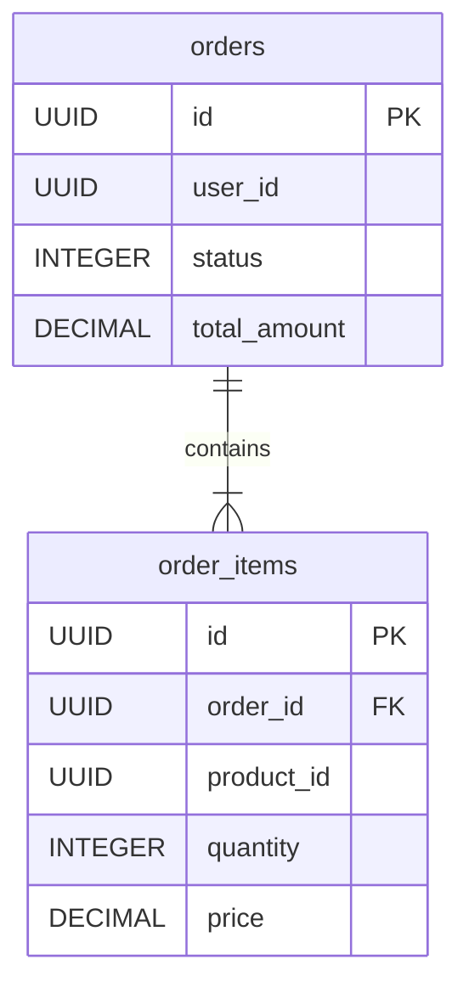

# Order Service - Database Schema

## Overview
The Order Service uses PostgreSQL to store order and order item information. This document details the database schema, tables, and relationships.

## Tables

### 1. `orders`

Stores the main order information.

| Column | Type | Constraints | Description |
|--------|------|-------------|-------------|
| `id` | UUID | PRIMARY KEY, DEFAULT gen_random_uuid() | Unique identifier for the order |
| `user_id` | UUID | NOT NULL | ID of the user who placed the order |
| `status` | INTEGER | NOT NULL, DEFAULT 1 | Order status (see Order Status Codes) |
| `total_amount` | DECIMAL(10,2) | NOT NULL, CHECK (>= 0) | Total cost of the order |
| `shipping_address` | TEXT | NOT NULL | Shipping address |
| `billing_address` | TEXT | NOT NULL | Billing address |
| `payment_method` | VARCHAR(50) | NOT NULL | Payment method used |
| `created_at` | TIMESTAMP | NOT NULL, DEFAULT NOW() | Timestamp when order was created |
| `updated_at` | TIMESTAMP | NOT NULL, DEFAULT NOW() | Timestamp when order was last updated |

### 2. `order_items`

Stores individual items within an order.

| Column | Type | Constraints | Description |
|--------|------|-------------|-------------|
| `id` | UUID | PRIMARY KEY, DEFAULT gen_random_uuid() | Unique identifier for the order item |
| `order_id` | UUID | NOT NULL, REFERENCES orders(id) ON DELETE CASCADE | Foreign key to the parent order |
| `product_id` | UUID | NOT NULL | ID of the product purchased |
| `product_name` | VARCHAR(255) | NOT NULL | Name of the product at time of purchase |
| `quantity` | INTEGER | NOT NULL, CHECK (> 0) | Quantity purchased |
| `price` | DECIMAL(10,2) | NOT NULL, CHECK (>= 0) | Price per unit at time of purchase |
| `subtotal` | DECIMAL(10,2) | NOT NULL, CHECK (>= 0) | Total price (quantity * price) |
| `created_at` | TIMESTAMP | NOT NULL, DEFAULT NOW() | Timestamp when item was created |

## Indexes

| Index Name | Table | Columns | Type | Usage |
|------------|-------|---------|------|-------|
| `idx_orders_user_id` | `orders` | `user_id` | B-TREE | Filtering orders by user |
| `idx_orders_status` | `orders` | `status` | B-TREE | Filtering orders by status |
| `idx_orders_created_at` | `orders` | `created_at DESC` | B-TREE | Sorting orders by date (newest first) |
| `idx_order_items_order_id` | `order_items` | `order_id` | B-TREE | Retrieving items for a specific order |
| `idx_order_items_product_id` | `order_items` | `product_id` | B-TREE | Analyzing sales by product |

## Order Status Codes

The `status` column in the `orders` table maps to the following values:

| Value | Status | Description |
|-------|--------|-------------|
| 1 | PENDING | Order created, awaiting confirmation/payment |
| 2 | CONFIRMED | Order confirmed by system/admin |
| 3 | PROCESSING | Order is being prepared/packed |
| 4 | SHIPPED | Order has been shipped |
| 5 | DELIVERED | Order has been delivered to customer |
| 6 | CANCELLED | Order has been cancelled |
| 7 | REFUNDED | Order has been refunded |

## Triggers

### `update_orders_updated_at`
- **Table**: `orders`
- **Event**: `BEFORE UPDATE`
- **Function**: Updates the `updated_at` column to the current timestamp whenever a row is modified.

## Relations

